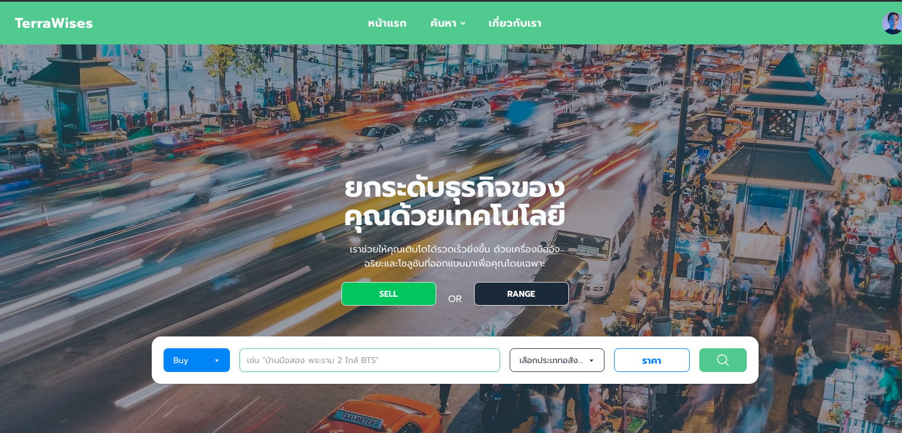
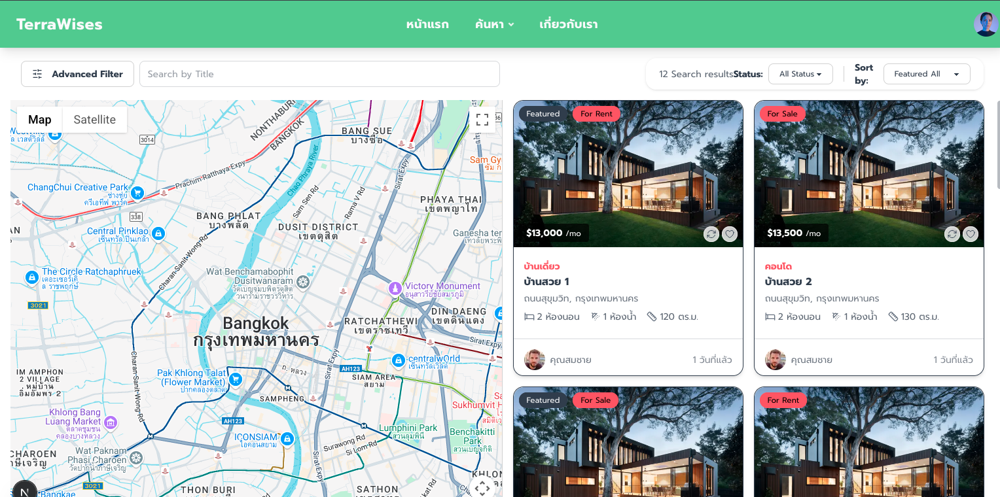
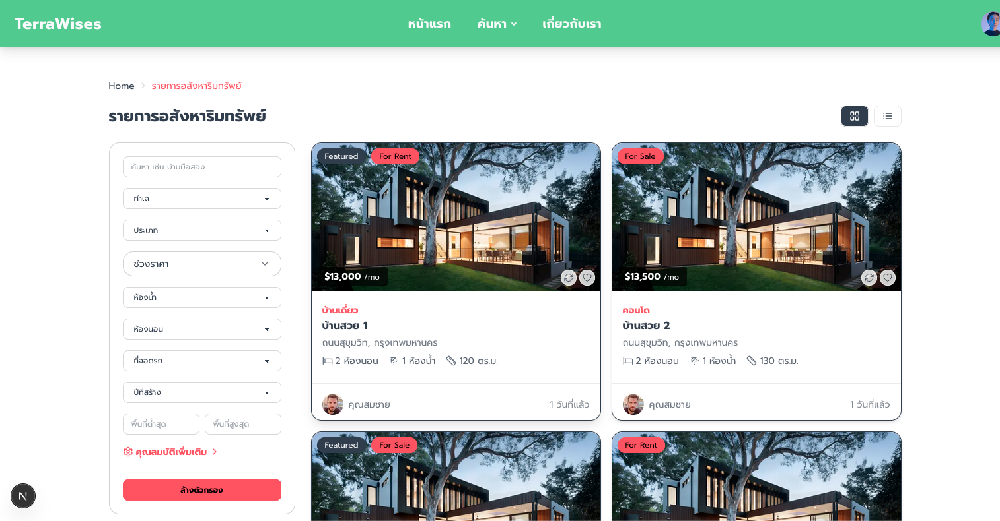

# Property App

A modern property listing and management web application built with Next.js and TypeScript.

## Features

- Property listing and search
- Favorites and recently viewed properties
- Interactive map view
- Messaging system between users
- User profile and dashboard
- Responsive sidebar and navigation
- Beautiful UI with Tailwind CSS

## App Preview

<div align="center">
  
</div>

## Screenshots

Below are some screenshots of the app (see `/public/review/`):

| Home 1                             | Home 2                             | Home 3                             |
| ---------------------------------- | ---------------------------------- | ---------------------------------- |
|  |  |  |

## Getting Started

1. **Install dependencies:**
   ```bash
   npm install
   ```
2. **Run the development server:**
   ```bash
   npm run dev
   ```
3. **Open [http://localhost:3000](http://localhost:3000) in your browser.**

## Project Structure

- `src/app/` — Main application pages and components
- `public/` — Static assets and images
- `public/review/` — App screenshots

## Contact

For more information or support, contact: [devkit002@gmail.com](mailto:devkit002@gmail.com)
